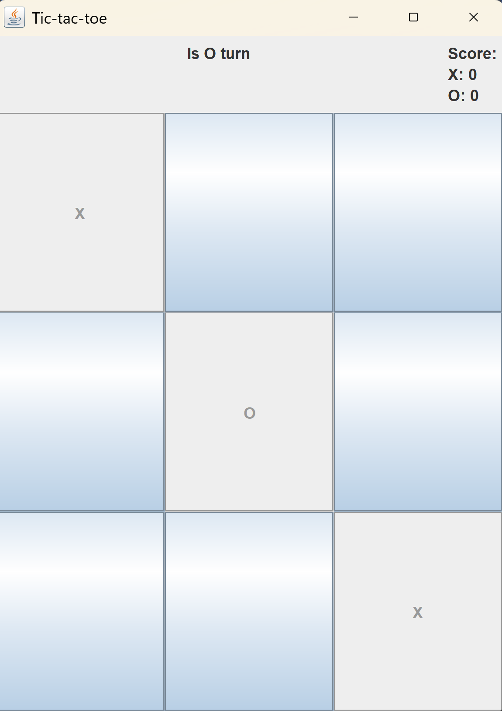
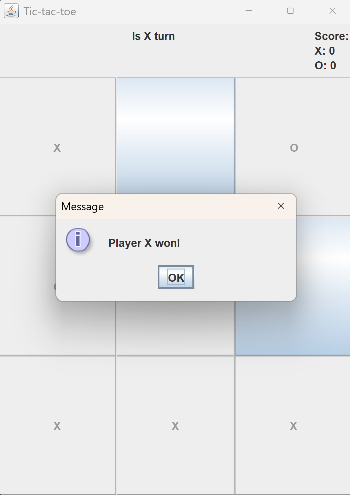

# Tic-Tac-Toe

This is a two-player Tic-Tac-Toe game created in Java.

The graphical user interface was built using Java Swing. The project also uses Object-Oriented Programming (OOP) principles to represent the different elements of the game. 

## Features

- Two-player local gameplay
- Turn-based system
- Score tracking
- Winner detection
- Draw detection
- Graphical interface with Java Swing
- Board reset system

## Technologies Used

- Java
- Java Swing
- OOP

## How to Run

- clone repository
- open in IDE
- run main class

## What I Practiced

- event-driven programming
- GUI development
- object-oriented design
- game logic
- action listeners

## Project Structure

```text
tic-tac-toe/
├── src/
│   ├── entities/
│   │   ├── Player.java
│   │   ├── Referee.java
│   │   └── Turn.java
│   │
│   ├── logic/
│   │   └── GameLogic.java
│   │
│   ├── main/
│   │   └── Main.java
│   │
│   └── view/
│       └── GameView.java
│
├── .gitignore
└── README.md
```

## Screenshots

### Gameplay

<p align="center">
  
</p>

### Winner Screen
<p align="center">
    
</p>

## Future Improvements

- Single-player mode with AI
- Better UI styling
- Sound effects
- Online multiplayer
- Minimax algorithm

## License

This project is for educational purposes.